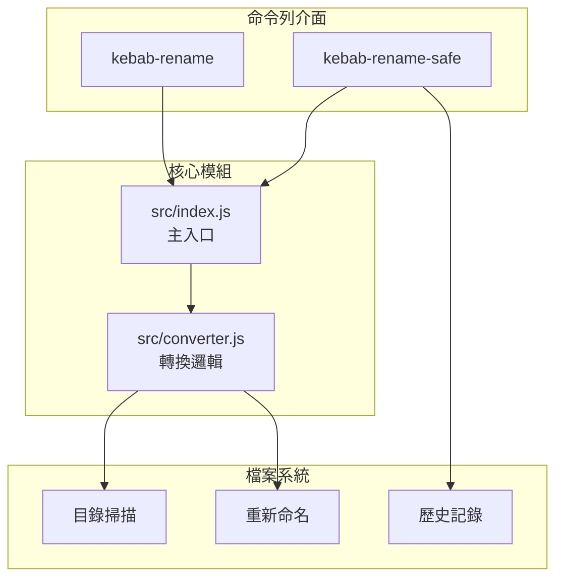

# Kebab Rename 檔名轉換器

[](https://opensource.org/licenses/MIT)
[](https://nodejs.org/)
[](https://developer.mozilla.org/docs/Web/JavaScript)

[← 回到 Muripo HQ](https://tznthou.github.io/muripo-hq/) | [English](README_EN.md)

一鍵把檔名轉成 kebab-case，現在也支援 camelCase。

> **"命名是程式的起點，好名字是好程式的開始。"**

---

## 核心概念

**kebab-case** 是程式界的標準命名風格，單字用連字號 `-` 串起來，看起來就像烤肉串上一塊塊的肉：

```
  my - file - name
  🥩   🥩     🥩
  ───────────────  ← 竹籤
```

這個 CLI 工具讓你一鍵批量轉換資料夾內的所有檔案名稱，支援預覽模式（預設）、遞迴處理、副檔名篩選，還有 Think Hard 模式提供備份與回滾功能。

---

## 功能特色

| 功能 | 說明 |
|------|------|
| **智慧轉換** | 自動處理 CamelCase、snake_case、空格、特殊符號 |
| **客製風格** | 可選擇輸出 kebab-case 或 camelCase |
| **預覽優先** | 預設只顯示會改什麼，不實際執行 |
| **安全機制** | 自動跳過 `.git`、`node_modules` 等敏感目錄 |
| **衝突處理** | 檔名重複時自動加數字後綴 |
| **保留中文** | 中文檔名維持原樣不動 |
| **Think Hard 模式** | `kebab-rename-safe` 提供詳細分析、備份與回滾 |

---

## 系統架構



---

## 技術棧

| 技術 | 用途 | 備註 |
|------|------|------|
| Node.js | 執行環境 | v18+ |
| JavaScript ES6+ | 主要語言 | ESM 模組 |
| Commander.js | CLI 參數解析 | v12+ |
| Node Test Runner | 單元測試 | 內建測試框架 |

---

## 快速開始

### 環境需求

- Node.js 18+

### 使用方式

```bash
# 不用安裝，一行搞定
npx kebab-rename ./your-folder

# 實際執行重新命名
npx kebab-rename ./your-folder --yes

# 遞迴處理子目錄
npx kebab-rename ./my-folder -r -y

# Think Hard 模式（更安全）
npx kebab-rename-safe ./my-folder -r
```

### 全域安裝

```bash
npm install -g kebab-rename
kebab-rename ./my-folder
```

---

## 專案結構

```
day-02-kebab-rename/
├── bin/
│   ├── kebab-rename.js      # 標準 CLI 入口
│   └── kebab-rename-safe    # Think Hard 模式入口
├── src/
│   ├── index.js             # 核心邏輯
│   └── converter.js         # 轉換規則
├── test/
│   └── cli.test.js          # 單元測試
├── .kebab-rename-history/   # 操作歷史（自動生成）
├── package.json
├── README.md
└── README_EN.md
```

---

## 轉換規則

| 轉換前 | 轉換後 |
|--------|--------|
| `My Document.txt` | `my-document.txt` |
| `CamelCaseFile.ts` | `camel-case-file.ts` |
| `snake_case_name.py` | `snake-case-name.py` |
| `Photo (1).jpg` | `photo-1.jpg` |
| `IMPORTANT_FILE.md` | `important-file.md` |
| `XMLParser.js` | `xml-parser.js` |
| `中文檔案.txt` | `中文檔案.txt` |

---

## CLI 選項

### kebab-rename

| 選項 | 說明 |
|------|------|
| `-y, --yes` | 實際執行重新命名（不加就是預覽模式） |
| `-r, --recursive` | 遞迴處理子目錄 |
| `-e, --ext <副檔名>` | 只處理特定副檔名，逗號分隔（如 `.jpg,.png`） |
| `-s, --style <風格>` | 目標命名風格：`kebab`（預設）或 `camel` |
| `-d, --dry-run` | 預覽模式（預設行為，可省略） |
| `-h, --help` | 顯示說明 |
| `-V, --version` | 顯示版本 |

### kebab-rename-safe（Think Hard 模式）

| 選項 | 說明 |
|------|------|
| `-r, --recursive` | 遞迴處理子目錄 |
| `-s, --style <風格>` | 目標命名風格：`kebab`（預設）或 `camel` |
| `-e, --ext <副檔名>` | 只處理特定副檔名，逗號分隔 |
| `-f, --force` | 跳過確認直接執行（仍會備份） |
| `--undo` | 回滾上次操作 |
| `--history` | 顯示操作歷史 |
| `-h, --help` | 顯示說明 |

---

## 安全機制

| 機制 | 說明 |
|------|------|
| **預設預覽** | 不加 `--yes` 絕對不會動到檔案 |
| **跳過隱藏檔** | `.` 開頭的檔案不處理 |
| **跳過敏感目錄** | `node_modules`、`.git`、`dist`、`build` 等 |
| **衝突保護** | 目標檔名已存在時自動加數字後綴 |
| **自動備份** | Think Hard 模式執行前記錄完整路徑對照表 |
| **回滾功能** | `--undo` 可還原上次操作 |

---

## 隨想

### 程式界的命名動物園

| 命名風格 | 範例 | 長這樣 |
|----------|------|--------|
| **kebab-case** | `my-file-name` | 烤肉串 🍢 |
| **snake_case** | `my_file_name` | 蛇 🐍（底線趴地上像蛇） |
| **camelCase** | `myFileName` | 駱駝 🐫（大小寫起伏像駝峰） |
| **PascalCase** | `MyFileName` | 大駱駝（首字母也大寫） |

### 為什麼要用 kebab-case？

- **URL 友善**：瀏覽器不會對 `-` 做編碼，`my-file` 比 `my%20file` 好看
- **易讀性高**：`my-long-file-name` 比 `mylongfilename` 清楚多了
- **業界慣例**：CSS class、HTML 屬性、CLI 參數都用這個風格

---

## 授權

本專案採用 [MIT](LICENSE) 授權。

---

## 作者

子超 - [tznthou@gmail.com](mailto:tznthou@gmail.com)

---

## 相關專案

這是 32 天連續專案挑戰的第 2 天作品。完整專案列表請參考：

- [Muripo HQ](https://tznthou.github.io/muripo-hq/) - 專案總部

---

> **"命名是程式的起點，好名字是好程式的開始。"**
