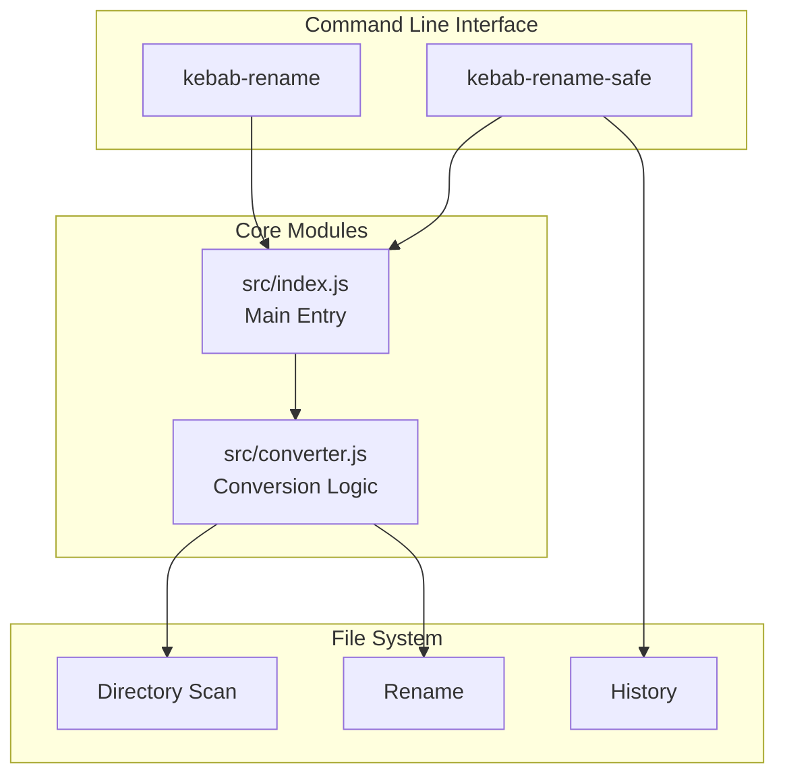

# Kebab Rename

[](https://opensource.org/licenses/MIT)
[](https://nodejs.org/)
[](https://developer.mozilla.org/docs/Web/JavaScript)

[← Back to Muripo HQ](https://tznthou.github.io/muripo-hq/) | [中文](README.md)

One-click batch file renaming to kebab-case, now with camelCase support too.

> **"Naming is the starting point of programming, and good names lead to good programs."**

---

## Core Concept

**kebab-case** is a standard naming convention in programming. Words are strung together with hyphens `-`, looking like pieces of meat on a skewer:

```
  my - file - name

  ---------------  <- skewer
```

This CLI tool lets you batch-convert all filenames in a folder with one command, supporting preview mode (default), recursive processing, extension filtering, and a Think Hard mode with backup and rollback features.

---

## Features

| Feature | Description |
|---------|-------------|
| **Smart Conversion** | Automatically handles CamelCase, snake_case, spaces, and special characters |
| **Custom Style** | Choose between kebab-case or camelCase output |
| **Preview First** | Default mode shows what will change without executing |
| **Safety Mechanisms** | Automatically skips `.git`, `node_modules`, and other sensitive directories |
| **Conflict Handling** | Automatically adds numeric suffixes when filenames collide |
| **Preserves Chinese** | Chinese filenames remain unchanged |
| **Think Hard Mode** | `kebab-rename-safe` provides detailed analysis, backup, and rollback |

---

## Architecture



---

## Tech Stack

| Technology | Purpose | Notes |
|------------|---------|-------|
| Node.js | Runtime | v18+ |
| JavaScript ES6+ | Main Language | ESM Modules |
| Commander.js | CLI Argument Parsing | v12+ |
| Node Test Runner | Unit Testing | Built-in Test Framework |

---

## Quick Start

### Prerequisites

- Node.js 18+

### Usage

```bash
# No installation needed, just one command
npx kebab-rename ./your-folder

# Actually execute the rename
npx kebab-rename ./your-folder --yes

# Recursively process subdirectories
npx kebab-rename ./my-folder -r -y

# Think Hard mode (safer)
npx kebab-rename-safe ./my-folder -r
```

### Global Installation

```bash
npm install -g kebab-rename
kebab-rename ./my-folder
```

---

## Project Structure

```
day-02-kebab-rename/
├── bin/
│   ├── kebab-rename.js      # Standard CLI entry
│   └── kebab-rename-safe    # Think Hard mode entry
├── src/
│   ├── index.js             # Core logic
│   └── converter.js         # Conversion rules
├── test/
│   └── cli.test.js          # Unit tests
├── .kebab-rename-history/   # Operation history (auto-generated)
├── package.json
├── README.md
└── README_EN.md
```

---

## Conversion Rules

| Before | After |
|--------|-------|
| `My Document.txt` | `my-document.txt` |
| `CamelCaseFile.ts` | `camel-case-file.ts` |
| `snake_case_name.py` | `snake-case-name.py` |
| `Photo (1).jpg` | `photo-1.jpg` |
| `IMPORTANT_FILE.md` | `important-file.md` |
| `XMLParser.js` | `xml-parser.js` |
| `Chinese-file.txt` | `Chinese-file.txt` |

---

## CLI Options

### kebab-rename

| Option | Description |
|--------|-------------|
| `-y, --yes` | Actually execute the rename (without it, preview only) |
| `-r, --recursive` | Recursively process subdirectories |
| `-e, --ext <extensions>` | Only process specific extensions, comma-separated (e.g., `.jpg,.png`) |
| `-s, --style <style>` | Target naming style: `kebab` (default) or `camel` |
| `-d, --dry-run` | Preview mode (default behavior, can be omitted) |
| `-h, --help` | Show help |
| `-V, --version` | Show version |

### kebab-rename-safe (Think Hard Mode)

| Option | Description |
|--------|-------------|
| `-r, --recursive` | Recursively process subdirectories |
| `-s, --style <style>` | Target naming style: `kebab` (default) or `camel` |
| `-e, --ext <extensions>` | Only process specific extensions, comma-separated |
| `-f, --force` | Skip confirmation and execute directly (still creates backup) |
| `--undo` | Rollback last operation |
| `--history` | Show operation history |
| `-h, --help` | Show help |

---

## Safety Mechanisms

| Mechanism | Description |
|-----------|-------------|
| **Default Preview** | Files are never touched without `--yes` |
| **Skip Hidden Files** | Files starting with `.` are not processed |
| **Skip Sensitive Directories** | `node_modules`, `.git`, `dist`, `build`, etc. |
| **Conflict Protection** | Automatically adds numeric suffix when target filename exists |
| **Auto Backup** | Think Hard mode records complete path mapping before execution |
| **Rollback** | `--undo` can restore the last operation |

---

## Reflections

### The Programming Naming Zoo

| Naming Style | Example | Looks Like |
|--------------|---------|------------|
| **kebab-case** | `my-file-name` | Shish kebab |
| **snake_case** | `my_file_name` | Snake (underscores lie flat like a snake) |
| **camelCase** | `myFileName` | Camel (uppercase letters form humps) |
| **PascalCase** | `MyFileName` | Big Camel (first letter also capitalized) |

### Why Use kebab-case?

- **URL Friendly**: Browsers don't encode `-`, so `my-file` looks better than `my%20file`
- **High Readability**: `my-long-file-name` is much clearer than `mylongfilename`
- **Industry Convention**: CSS classes, HTML attributes, and CLI parameters all use this style

---

## License

This project is licensed under [MIT](LICENSE).

---

## Author

Tznthou - [tznthou@gmail.com](mailto:tznthou@gmail.com)

---

## Related Projects

This is Day 2 of the 32-day consecutive project challenge. For the complete project list:

- [Muripo HQ](https://tznthou.github.io/muripo-hq/) - Project Headquarters

---

> **"Naming is the starting point of programming, and good names lead to good programs."**
